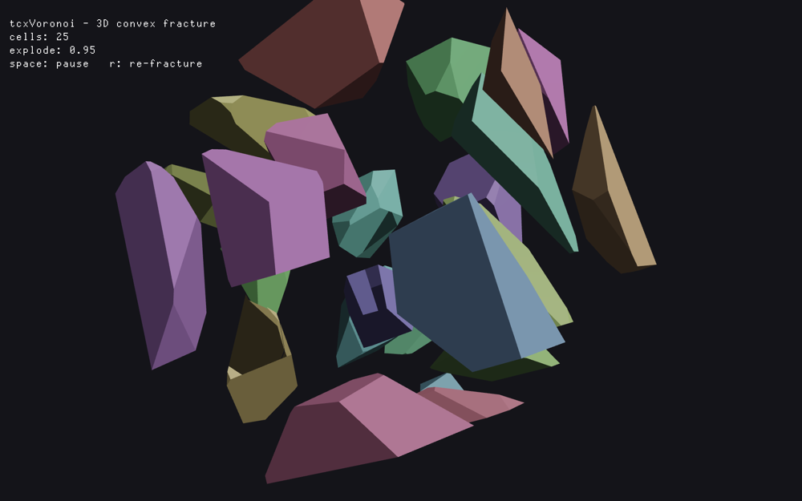

# tcxVoronoi

Voronoi fracture for [TrussC](https://github.com/TrussC-org/TrussC) — shatter a
mesh (or a 2D path) into Voronoi cells for destruction effects.



## What it does

Give it a closed mesh and some seed points; it splits the mesh into one fragment
per seed (that seed's Voronoi cell, intersected with the mesh). The same plane
slicer handles **convex and concave** meshes, **2D paths**, and **prismatic
glass/tile** cuts. No external dependency — just cascaded half-space slicing.

```cpp
#include <TrussC.h>
#include <tcxVoronoi.h>
using namespace std;
using namespace tc;
using namespace tcx;

Mesh box = createBox(200.0f);

// simplest
FractureResult r = voronoiFracture(box, 30);

// controlled (the Voronoi generator holds the settings and is reusable)
Voronoi v;
v.addSeed(impactPoint)               // your own points
 .setSeedCount(40)                   // fill the rest...
 .setDistribution(Distribution::Uniform)
 .setRandomSeed(123);
FractureResult r2 = v.fracture(box);

// escape hatch: specify every seed yourself
v.setSeeds(myPoints);

for (auto& cell : r.cells) {
    cell.mesh.draw();                // each fragment is a tc::Mesh
    // cell.seed, cell.centroid, cell.neighbors
}
// r.interfaces : shared faces between adjacent cells (cellA, cellB, point, normal)
// r.neighborsOf(i), r.interfaceBetween(a, b)
```

## 2D

`fracture2D(const Path&)` partitions a 2D shape (concave allowed) into cells,
mirroring the 3D API:

```cpp
FractureResult2D r = voronoiFracture2D(shape, 32);
for (auto& cell : r.cells) cell.path.drawFill();   // cell.path / seed / centroid / neighbors
```

## Prismatic (glass / tile)

A glass pane or tile is already a mesh, so fracture it with a 2D Voronoi pattern
by constraining the seeds to a plane — every cut then runs straight through and
each shard keeps the mesh's real front/back faces:

```cpp
Voronoi v;
v.setSeedPlane(Plane::fromPointNormal({0,0,0}, {0,0,1}))  // the pane's face
 .setDistribution(Distribution::Uniform)   // Uniform = glass, Grid = regular tiles
 .setSeedCount(28);
FractureResult r = v.fracture(glassMesh);
```

`fractureExtruded(path, thickness)` is a convenience that builds a slab from a 2D
outline and prismatically fractures it (for when you don't already have a mesh).

## Seeds

The final seed set is your explicit `addSeed()` points plus auto-generated points
(by the chosen `Distribution`) up to `setSeedCount()`. `setSeeds()` replaces
everything and disables auto-fill. Guiding the fracture is just choosing where the
seeds go — see `example-glassbreak` for a hand-built radial impact pattern.

## Examples

| Example | Shows |
| --- | --- |
| `example-basic` | 3D convex fracture (box), explode animation |
| `example-concave` | concave meshes (torus / sphere / cylinder) |
| `example-2d` | 2D path fracture (a star) |
| `example-slab` | prismatic glass / tile, Uniform vs Grid |
| `example-glassbreak` | interactive click-to-shatter, custom impact seeds |

## Physics

`tcxVoronoi` has **no** physics dependency. To drop fragments into a physics
world, include `<tcxVoronoiPhysics.h>` (and add `tcxPhysics` to `addons.make`) —
it adds convenience helpers built on `tcxPhysics`. *(planned)*

## License

MIT. See [LICENSES.md](LICENSES.md).
